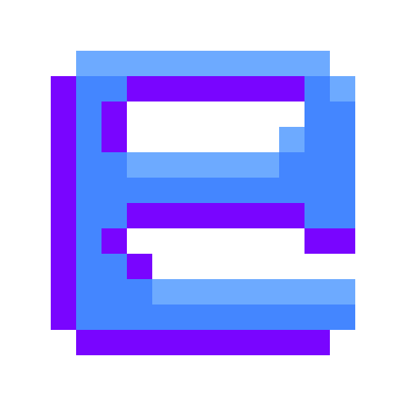

# Generic game Template

Template that makes it easy to create games with [OpenTK](https://github.com/opentk/opentk).  
Comes with user interfaces, sounds, a free camera, basic menus, options and customizable controls.

Everybody is free to use this as a template for their game or in any other way.

## What is included
- **Shader class**, with uniform pre-locating and optimized binding
- **Texture2D class**, with optimized binding and 8 unit support
- **Mesh class**, with support for static data, dynamic data and EBOs, on top of optimized binding
- **Camera class**, with movement and zoom
- **Sound** and **SoundManager** classes, that abstract on top of OpenAL for ease of use
- **Ui elements** and **screens**, that provide easy access to many useful elements
- **FontRenderer class**, that renders text of a bitmap font. It is also very customizable
- **Options**, such as vsync and maximum FPS, easily expandable
- **Controls**, that allow to change keybinds, easily expandable
- **AABBs**

## How to start creating a game
1. [Fork this GitHub repo](https://github.com/siljamdev/GenericGame/fork)
2. Setup a local Git repo and pull from your forked github
3. Start modifying what you wish and build using dotnet

## How it works
Mainly, [OpenTK](https://github.com/opentk/opentk) is used for graphics.  
[AshLib](https://github.com/siljamdev/AshLib) is used too, for the Dependencies class, the AshFiles for configs and the Color3 struct for colors across the renderers.